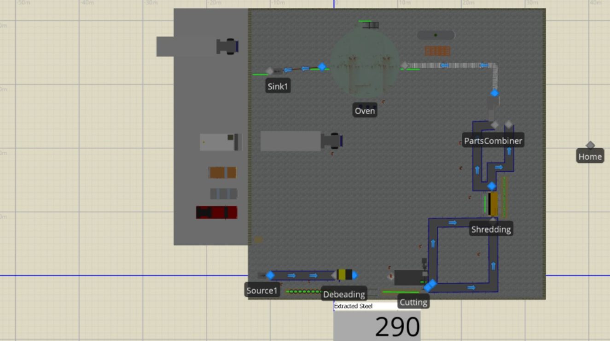
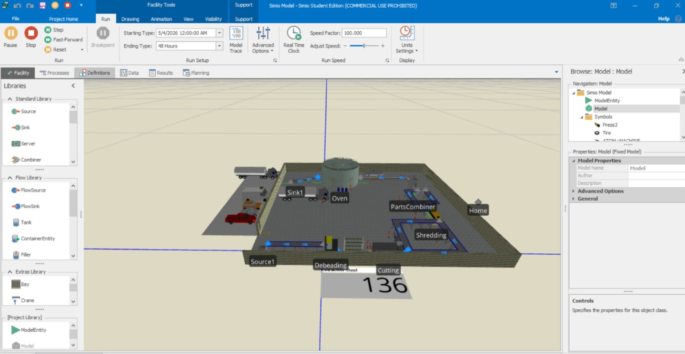
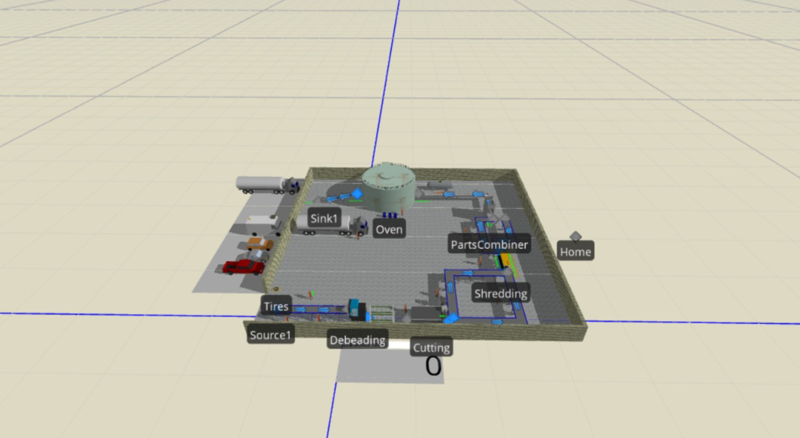
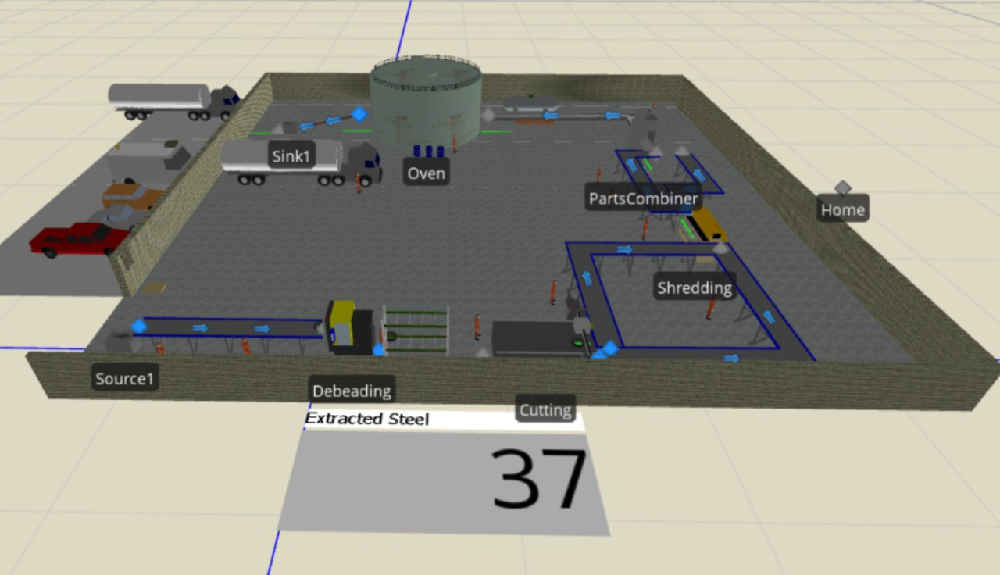

# BioFuel Waste Tyre Pyrolysis Study

**University of Petra – Graduation Project – Business Intelligence**
**Course:** 307498 – Graduation Project
**Semester:** First Semester, 2026/2027

---

## Title Page & Authors

**Project Title**
Simulation, Economic, Environmental, and Digital Monitoring Evaluation of a Small-Scale Waste Tyre Pyrolysis System

**Author**
Tala Salem Sameeh Bondoq
Student ID: 202311602

**Supervised by**
Dr. Ayman Mansour

**Department**
Business Intelligence and Data Analytics

**University**
University of Petra

**Date**
2026

---

## Repository Overview

This repository contains the complete Business Intelligence graduation project for the BioFuel waste tyre pyrolysis study. The project evaluates a proposed small-scale waste tyre pyrolysis system using simulation, economic feasibility analysis, environmental assessment, and digital monitoring.

The repository is organized to keep all project-related files in one place, including Markdown documentation, simulation materials, data folders, analysis files, dashboard visuals, model files, setup instructions, and supporting project documents.

The main purpose of this repository is to make the project easy to review, navigate, and reproduce using a professional GitHub structure.

---

## How to Use This Repository

1. Start with this `README.md` file to understand the project overview.
2. Open the documentation files inside the `docs/` folder for detailed project sections.
3. Review the simulation model and screenshots in the `models/` and `dashboards/images/` folders.
4. Review the analysis files inside the `notebooks/` and `src/` folders.
5. Open the BioFuel monitoring app prototype using the link provided in this README.
6. Use the setup guide if you want to clone or run any Python analysis files.

---

## Project Structure

```text
BioFuel-Tala/
├── README.md
├── docs/
│   ├── 01_project_description.md
│   ├── 02_data_research.md
│   ├── 03_data_analysis.md
│   ├── 04_dashboard_design.md
│   ├── 05_advanced_analytics.md
│   ├── 06_deployment.md
│   ├── SETUP.md
│   ├── EVALUATION_CRITERIA.md
│   └── Simulation_Report.docx
├── data/
│   ├── raw/
│   └── processed/
├── notebooks/
├── src/
├── dashboards/
│   ├── BioFuel_Waste_Tyre_Pyrolysis.pptx
│   └── images/
├── models/
│   └── simio_model.spfx
├── requirements.txt
└── .gitignore
```

---

## Table of Content

| Section                                                                                                               | Description                                                               |
| --------------------------------------------------------------------------------------------------------------------- | ------------------------------------------------------------------------- |
| [Abstract](#abstract)                                                                                                 | Concise summary of the project, method, and key findings                  |
| [Acknowledgment](#acknowledgment)                                                                                     | Appreciation for supervision and project support                          |
| [Business Intelligence Project Description and Objectives](#business-intelligence-project-description-and-objectives) | Project idea, industry domain, business problem, and objectives           |
| [Data Research and Acquiring Effort](#data-research-and-acquiring-effort)                                             | Data sources, assumptions, and acquisition method                         |
| [Data Description and Understanding](#data-description-and-understanding)                                             | Data dictionary, production assumptions, KPIs, and system inputs          |
| [Data Primary Cleaning and Transformation](#data-primary-cleaning-and-transformation)                                 | Data preparation steps and transformation logic                           |
| [Data Visualization and Insights](#data-visualization-and-insights)                                                   | Simulation visuals, charts, figures, and insights                         |
| [Dashboard Design & Business Insights](#dashboard-design--business-insights)                                          | Dashboard/app prototype and business questions answered                   |
| [Advanced Analytics and AI Modeling](#advanced-analytics-and-ai-modeling)                                             | Financial scenario analysis, sensitivity testing, and future AI direction |
| [Tools Research and Selection Effort](#tools-research-and-selection-effort)                                           | Tools evaluated and selected for the project                              |
| [Project Deployment Effort – Use Case](#project-deployment-effort--use-case)                                          | How the project can be consumed by business users                         |
| [Results](#results)                                                                                                   | Main findings, interpretation, business impact, and recommendations       |
| [References](#references)                                                                                             | Sources and references used in the project                                |
| [Code Setup and Dependencies Instructions](#code-setup-and-dependencies-instructions)                                 | How to clone, install dependencies, and open project files                |

---

## Project Documentation

The detailed academic documentation is maintained in the `docs/` folder. Each major section is written in a separate Markdown file to make the project easier to navigate and update.

| Documentation File                                                                            | Content                                                                   |
| --------------------------------------------------------------------------------------------- | ------------------------------------------------------------------------- |
| [01. Project Description and Objectives](docs/01_project_description.md)                      | Project background, business problem, scope, and objectives               |
| [02. Data Research and Acquiring Effort](docs/02_data_research.md)                            | Data sources, assumptions, acquisition method, and reliability notes      |
| [03. Data Description, Understanding, Cleaning, and Transformation](docs/03_data_analysis.md) | Data dictionary, production data, KPIs, and transformation steps          |
| [04. Data Visualization and Dashboard Design](docs/04_dashboard_design.md)                    | Simulation visuals, dashboard components, and business insights           |
| [05. Advanced Analytics and AI Modeling](docs/05_advanced_analytics.md)                       | Financial scenario analysis, sensitivity analysis, and future AI features |
| [06. Project Deployment Effort and Use Case](docs/06_deployment.md)                           | Deployment logic, business user use case, and prototype explanation       |
| [Setup Guide](docs/SETUP.md)                                                                  | Setup and usage instructions                                              |
| [Evaluation Criteria](docs/EVALUATION_CRITERIA.md)                                            | Evaluation rubric and project-specific assessment criteria                |
| [Complete Written Report](docs/Simulation_Report.docx)                                        | Supporting full written report                                            |

The main documentation is written in Markdown. The Word report and PowerPoint presentation are included as supporting materials.

---

## Abstract

This project evaluates the technical, economic, environmental, and digital monitoring feasibility of a small-scale waste tyre pyrolysis system for BioFuel Company. The system is designed to process end-of-life tyres and convert them into useful outputs such as pyrolysis oil, carbon black, gas, light fuel fraction, and steel wires. The project addresses the gap between waste tyre disposal and resource recovery by studying whether a small-scale pyrolysis plant can be operationally efficient, financially feasible, and environmentally beneficial.

The study uses an integrated Business Intelligence approach. A discrete-event simulation model was developed using Simio to represent the main production stages: tyre receiving, debeading, cutting, shredding, buffer storage, batch formation, pyrolysis reactor processing, and final product separation. The project also includes economic feasibility analysis, environmental impact assessment, financial sensitivity testing, and a digital monitoring application prototype.

The main finding is that the pyrolysis reactor is the system bottleneck because it operates in batch mode and requires the longest processing time. The model assumes a daily input of 1000–1500 tyres, equal to 10–15 tons per day, with a reactor capacity of 10 tons per batch and a processing time of 18–23 hours per batch. Economically, the expected scenario estimates a capital investment of 700,000 JD, expected net daily profit of 2,217 JD/day, annual net profit of 798,120 JD, payback period of 0.88 years, and ROI of approximately 114%. The project is considered technically feasible, economically promising, and environmentally beneficial under the stated assumptions.

---

## Acknowledgment

I would like to express my sincere appreciation to **Dr. Ayman Mansour** for his guidance, supervision, and support throughout this graduation project.

I would also like to thank the **University of Petra – Department of Business Intelligence and Data Analytics** for providing the academic environment and support needed to complete this project.

Special thanks are also extended to everyone who supported the development of this study, including the simulation model, economic feasibility analysis, environmental assessment, and digital monitoring prototype.

---

## Business Intelligence Project Description and Objectives

### What is the project about?

This project is about evaluating a proposed small-scale waste tyre pyrolysis system for BioFuel Company. The system receives waste tyres and processes them through a sequence of mechanical and thermal stages until they are converted into useful outputs.

The project does not only study pyrolysis as a chemical process. It studies the system as a complete production and business process using simulation, data analysis, economic indicators, environmental reasoning, and digital monitoring.

### What industry or business domain does it address?

The project addresses several connected domains:

* Waste management
* Recycling
* Renewable and alternative fuel production
* Industrial operations
* Resource recovery
* Circular economy
* Business Intelligence and decision support

### How will it help the industry/business?

The project helps the business understand whether investing in a small-scale pyrolysis plant is reasonable under the proposed assumptions. It also identifies the main operational bottleneck, estimates financial performance, highlights environmental benefits, and proposes a digital monitoring interface for better control.

### What specific business problems are being solved?

The project focuses on solving the following business problems:

1. How can waste tyres be converted into useful products?
2. Can the proposed plant process 10–15 tons per day?
3. Which process stage limits production?
4. Is the project financially feasible?
5. What risks affect profitability?
6. How can plant operations be monitored digitally?
7. What improvements should be made before real implementation?

---

## Data Research and Acquiring Effort

### What data was searched for and why?

The project required data related to the production flow, machine processing times, reactor capacity, batching logic, financial assumptions, product output assumptions, and environmental recovery values. This data was needed to build the simulation model, evaluate feasibility, and support decision-making.

### How was the data acquired?

The data was collected and estimated from:

| Source                          | Data Acquired                                                | Purpose                                        |
| ------------------------------- | ------------------------------------------------------------ | ---------------------------------------------- |
| BioFuel project assumptions     | Daily capacity, process flow, reactor logic                  | Build the base simulation model                |
| Waste tyre pyrolysis literature | Product outputs, sustainability context, process assumptions | Support technical and environmental discussion |
| Simio modeling requirements     | Entities, queues, capacities, processing times               | Develop the discrete-event simulation          |
| Economic estimates              | CAPEX, OPEX, profit, payback, ROI                            | Evaluate financial feasibility                 |
| Digital monitoring prototype    | Dashboard needs, reactor monitoring, alerts, reports         | Support app design and deployment use case     |

### Links to Project Sources

| Source | Link / Location | Description |
|---|---|---|
| Simio simulation model | [Open](dashboards/Simio_Model.spfx) | Used to represent the plant process flow, queues, batching logic, and reactor bottleneck. |
| BioFuel monitoring app prototype | [Open](https://iofuel.oneapp.dev/) | Used to demonstrate the digital monitoring concept, including reactor tracking, alerts, reports, and material levels. |
| Presentation PDF | [Open](dashboards/BioFuel_Waste_Tyre_Pyrolysis.pdf) | Used as a summary reference for key indicators, simulation results, financial results, and recommendations. |
| Project Report + References | [Open](dashboards/Simulation_and_Economic_Evaluation_of_a_Small_Scale_Waste_Tyre_Pyrolysis_System_(2)_(1)_(4).pdf) | Used to support the literature review, waste tyre pyrolysis background, simulation method, and environmental assessment. |
---

## Data Description and Understanding

### General Production Data

| Parameter                     |                     Value |
| ----------------------------- | ------------------------: |
| Average tyre weight           |                     10 kg |
| Tyres processed per day       |           1000–1500 tyres |
| Daily production capacity     |            10–15 tons/day |
| Pieces per tyre after cutting |                  4 pieces |
| Total pieces per day          |          4000–6000 pieces |
| Reactor capacity              |             10 tons/batch |
| Reactor processing time       |         18–23 hours/batch |
| Expected reactor output       | Approximately 1 batch/day |

### Processing Time Assumptions

| Process   | Processing Time             | Unit        | Capacity |
| --------- | --------------------------- | ----------- | -------: |
| Debeading | Triangular(0.2, 0.3, 0.5)   | min/tyre    |        1 |
| Cutting   | Triangular(0.15, 0.25, 0.4) | min/tyre    |        1 |
| Shredding | Triangular(0.25, 0.4, 0.6)  | min/piece   |        1 |
| Reactor   | Triangular(18, 20, 23)      | hours/batch |  10 tons |

### Data Dictionary

| Field                   | Meaning                                         | Why It Matters                         |
| ----------------------- | ----------------------------------------------- | -------------------------------------- |
| `tyre_weight_kg`        | Average weight of one tyre                      | Converts tyre count into tons          |
| `tyres_per_day`         | Daily tyre input                                | Defines production load                |
| `pieces_per_tyre`       | Number of pieces after cutting                  | Determines shredding and batching load |
| `pieces_per_batch`      | Number of pieces required for one reactor batch | Controls batching logic                |
| `reactor_capacity_tons` | Reactor capacity per batch                      | Defines maximum batch size             |
| `reactor_cycle_time`    | Time needed to process one batch                | Determines bottleneck behavior         |
| `capex`                 | Capital investment cost                         | Used in payback and ROI calculations   |
| `daily_profit`          | Expected daily net profit                       | Used to evaluate feasibility           |

### Key Performance Indicators

| KPI                 | Purpose                                                 |
| ------------------- | ------------------------------------------------------- |
| Throughput          | Measures the amount of material processed by the system |
| Reactor utilization | Measures how intensively the reactor is used            |
| Machine utilization | Evaluates preprocessing equipment usage                 |
| Queue size          | Identifies congestion points                            |
| Waiting time        | Measures delays before each process                     |
| Buffer level        | Evaluates material accumulation before batching         |
| Completed batches   | Measures production cycle achievement                   |
| Bottleneck location | Identifies the process limiting system performance      |

---

## Data Primary Cleaning and Transformation

The project data was prepared by converting raw assumptions into simulation-ready and analysis-ready values.

### 1. Tyre count to weight conversion

```text
1000 tyres × 10 kg = 10,000 kg = 10 tons
1500 tyres × 10 kg = 15,000 kg = 15 tons
```

### 2. Tyres to pieces conversion

```text
1 tyre = 4 pieces
1000 tyres = 4000 pieces
1500 tyres = 6000 pieces
```

### 3. Reactor batching logic

```text
1 reactor batch = 10 tons
10 tons = 1000 tyres
1000 tyres = 4000 pieces
4000 pieces = 1 full reactor batch
```

### 4. Financial scenario preparation

The economic model was organized into three scenarios:

| Scenario     | Purpose                                       |
| ------------ | --------------------------------------------- |
| Conservative | Tests lower profit or higher risk conditions  |
| Expected     | Represents the main expected operating case   |
| Optimistic   | Tests better revenue or lower cost conditions |

### 5. Output recovery assumptions

The environmental and product recovery analysis used the following assumed output categories:

| Product             | Approximate Yield |
| ------------------- | ----------------: |
| Pyrolysis oil       |               40% |
| Carbon black        |            30–40% |
| Gas                 |               10% |
| Light fuel fraction |               10% |
| Steel wires         |               10% |

---

## Data Visualization and Insights

The project includes simulation screenshots, process visuals, tables, and dashboard components to explain the system behavior and business insights.

### Figure 1: Simio Top View



**Description:**  
This figure shows the top view of the Simio simulation model for the BioFuel waste tyre pyrolysis system.

**Insight Derived:**  
The layout shows the full movement of waste tyres through source, debeading, cutting, shredding, batching, reactor processing, and final output.

---

### Figure 2: Simio Operational View



**Description:**  
This figure shows the simulation model during operation inside Simio.

**Insight Derived:**  
It shows the actual simulation environment and how the system components are connected during the 48-hour run.

---

### Figure 3: Simio 3D Model View



**Description:**  
This figure shows the 3D view of the simulated pyrolysis plant.

**Insight Derived:**  
The visual makes the full plant layout clearer and shows how the preprocessing line leads toward the reactor and output area.

---

### Figure 4: Simio Close Operational View



**Description:**  
This figure shows a closer operational view of the main preprocessing and reactor area.

**Insight Derived:**  
The close view highlights the important production stages: debeading, cutting, shredding, parts combining, and reactor processing.
---

## Dashboard Design & Business Insights

The project includes a BioFuel digital monitoring app prototype. The app is designed to support operational visibility and help users monitor important plant indicators such as machine status, material levels, reactor condition, alerts, reports, temperature, humidity, and output information.

**App Prototype:** [Open BioFuel Monitoring App](https://iofuel.oneapp.dev/)

### Dashboard Components

| Dashboard Component | Description | Business Insight |
|---|---|---|
| General Dashboard | Displays the overall plant condition | Helps users understand the system status quickly |
| Reactor Dashboard | Focuses on reactor status and batch condition | Supports monitoring of the main bottleneck |
| Material Levels | Shows available and processed material | Helps manage batching and inventory |
| Alerts and Reports | Displays warnings and operational notes | Helps operators respond faster to issues |
| Temperature and Humidity | Shows monitoring indicators | Supports safer and more stable operation |
| Output Tracking | Shows product-related information | Connects production output with business value |

The dashboard prototype supports decision-making by making the system easier to monitor. Since the reactor is the main bottleneck, reactor monitoring is especially important for reducing downtime and improving production performance.
---

## Advanced Analytics and AI Modeling

The advanced analytics part of the project focuses on financial scenario analysis and sensitivity testing. Python was used to evaluate how changes in operating costs and product profit affect financial feasibility.

### Model Type

The project uses a financial scenario and sensitivity model. It is not a deployed machine learning model. The model supports decision-making by testing different financial conditions and showing how the project behaves under conservative, expected, and optimistic cases.

### Scenario Results

| Scenario     | Net Daily Profit | Monthly Net Profit | Annual Net Profit | Payback Period |     ROI |
| ------------ | ---------------: | -----------------: | ----------------: | -------------: | ------: |
| Conservative |         1,817 JD |          54,510 JD |        654,120 JD |     1.07 years |  93.45% |
| Expected     |         2,217 JD |          66,510 JD |        798,120 JD |     0.88 years | 114.02% |
| Optimistic   |         2,617 JD |          78,510 JD |        942,120 JD |     0.74 years | 134.59% |

### Main Risk Drivers

| Risk Variable         | Effect on Feasibility |
| --------------------- | --------------------- |
| Pyrolysis oil price   | Very high             |
| Daily production rate | Very high             |
| Reactor downtime      | High                  |
| Product quality       | High                  |
| Labor and energy cost | Medium                |
| Market access         | High                  |

### Future AI Direction

In future development, the monitoring app could be connected to real sensors and used for AI-based decision support, such as:

* Predicting reactor downtime
* Detecting abnormal operating conditions
* Forecasting product output
* Recommending maintenance actions
* Sending early alerts before equipment failure

---

## Tools Research and Selection Effort

| Tool           | Why It Was Selected                      | How It Supports the Project                                       |
| -------------- | ---------------------------------------- | ----------------------------------------------------------------- |
| Simio          | Suitable for discrete-event simulation   | Models process flow, queues, resources, batching, and bottlenecks |
| Python         | Flexible for financial modeling          | Supports scenario analysis and sensitivity testing                |
| GitHub         | Professional version control platform    | Organizes documentation, files, code, and project history         |
| Markdown       | Simple and readable documentation format | Makes project sections easy to review in GitHub                   |
| PowerPoint     | Suitable for presentation delivery       | Presents project summary and results visually                     |
| OneApp         | Supports app prototype development       | Demonstrates the digital monitoring concept                       |
| Excel / Tables | Useful for organizing assumptions        | Supports cost, revenue, and output calculations                   |

---

## Project Deployment Effort – Use Case

### How will a business user consume this project?

A business user, plant manager, or investor can use this project through:

* GitHub repository documentation
* Simulation model file
* PowerPoint presentation
* Dashboard visuals
* BioFuel mobile app prototype
* Financial scenario analysis
* Setup and usage instructions

### Use Case

A plant manager wants to understand whether the BioFuel pyrolysis system can operate efficiently and generate value. The manager opens the README, reviews the documentation, checks the simulation results, studies the financial scenario analysis, and opens the app prototype to see how the plant could be monitored digitally.

### Implementation Steps

1. Organize all project files in the GitHub repository.
2. Document the project sections in Markdown.
3. Upload data assumptions and supporting files.
4. Add Simio simulation files and screenshots.
5. Add Python analysis files or notebooks.
6. Link the digital monitoring app prototype.
7. Use the README as the main navigation page.
8. Review all links and files before submission.

### Infrastructure and Hosting Considerations

The current deployment is academic and prototype-based. For real implementation, the system would require live sensors, databases, cloud hosting, user authentication, machine integration, and safety monitoring.

---

## Results

The project shows that the proposed BioFuel waste tyre pyrolysis system is technically feasible under the stated assumptions. The preprocessing stages can supply material effectively, but the reactor controls total throughput because it is batch-based and requires 18–23 hours per batch.

Economically, the expected scenario shows strong feasibility. The estimated CAPEX is 700,000 JD, expected net daily profit is 2,217 JD/day, expected annual net profit is 798,120 JD, payback period is 0.88 years, and ROI is approximately 114%. However, these results depend on product prices, reactor uptime, market access, product quality, and operating costs.

Environmentally, the project supports circular economy principles by converting waste tyres into useful outputs such as pyrolysis oil, carbon black, gas, light fuel fraction, and steel wires. The reuse of gas as an internal energy source can also support energy recovery and improve sustainability.

### Main Findings

* The system can process approximately 10–15 tons of waste tyres per day.
* The reactor capacity is 10 tons per batch.
* The reactor cycle time is approximately 18–23 hours.
* The reactor is the main bottleneck.
* Preprocessing stages are not the main limitation.
* The expected net daily profit is 2,217 JD/day.
* The expected payback period is 0.88 years.
* The expected ROI is approximately 114%.
* Digital monitoring adds value by focusing attention on reactor status, alerts, reports, and material levels.

### Recommendations

1. Improve reactor performance by reducing cycle time, improving loading/unloading, or increasing capacity.
2. Secure buyers for pyrolysis oil, carbon black, and steel wires before investment.
3. Test product quality before final market decisions.
4. Monitor reactor downtime because it directly affects production and profit.
5. Include environmental permits, gas treatment, and safety systems in the final plan.
6. Continue developing the monitoring app into a real connected system.
7. Validate the model using real trials, supplier quotations, and updated market prices.

---

## Code Setup and Dependencies Instructions

### 1. Clone the repository

```bash
git clone <repository-url>
```

### 2. Navigate to the project directory

```bash
cd BioFuel-Tala
```

### 3. Install dependencies

```bash
pip install -r requirements.txt
```

### 4. Open the documentation

```text
docs/01_project_description.md
```

### 5. Open the app prototype

[BioFuel Monitoring App](https://iofuel.oneapp.dev/)

### Suggested `requirements.txt`

```text
pandas==2.0.0
numpy==1.24.0
matplotlib==3.7.0
seaborn==0.12.0
plotly==5.14.0
scikit-learn==1.3.0
jupyter==1.0.0
streamlit==1.25.0
sqlalchemy==2.0.0
```

---

## Documentation Best Practices Followed

* The project is documented using Markdown.
* The README links the main documentation sections.
* Visuals are included to support understanding.
* Data sources and assumptions are explained.
* Project files are organized in one repository.
* Supporting files are placed in suitable folders.
* Setup and evaluation files are included.
* The project structure follows the Business Intelligence graduation project format.

---

## Flexibility by Project Type

| Project Type          | Emphasis in This Project                           | Related Sections                     |
| --------------------- | -------------------------------------------------- | ------------------------------------ |
| Dashboard-Heavy       | Digital monitoring app and dashboard visuals       | Data Visualization, Dashboard Design |
| Business Analysis     | Feasibility, recommendations, and decision support | Project Description, Results         |
| Advanced Analytics    | Financial scenarios and sensitivity testing        | Advanced Analytics and AI Modeling   |
| Data Engineering      | Data preparation and transformation                | Data Cleaning and Transformation     |
| Deployment / Use Case | GitHub repository and app prototype                | Project Deployment Effort            |

---

## Limitations

This project is a preliminary feasibility study and not a final industrial plant design. The model is based on project assumptions, literature values, estimated financial data, and simulation logic.

Real implementation would require:

* Supplier quotations
* Real operating trials
* Environmental permits
* Product quality testing
* Updated market prices
* Safety and emission control studies
* Reactor reliability validation
* Live sensor and machine integration

---

## References

The full list of academic and technical references is included in the documentation files inside the `docs/` folder.

Main reference areas include:

* Waste tyre pyrolysis literature
* Discrete-event simulation
* Economic feasibility analysis
* Environmental sustainability and circular economy
* Industrial digital monitoring and dashboard design

---

## Final Conclusion

The proposed BioFuel small-scale waste tyre pyrolysis system is technically feasible, financially promising, and environmentally beneficial under the stated assumptions.

The most important finding is that the pyrolysis reactor controls the overall system. Since it operates in batch mode and requires the longest processing time, improving reactor cycle time, capacity, or availability would create the strongest positive impact on throughput, profitability, and environmental performance.
